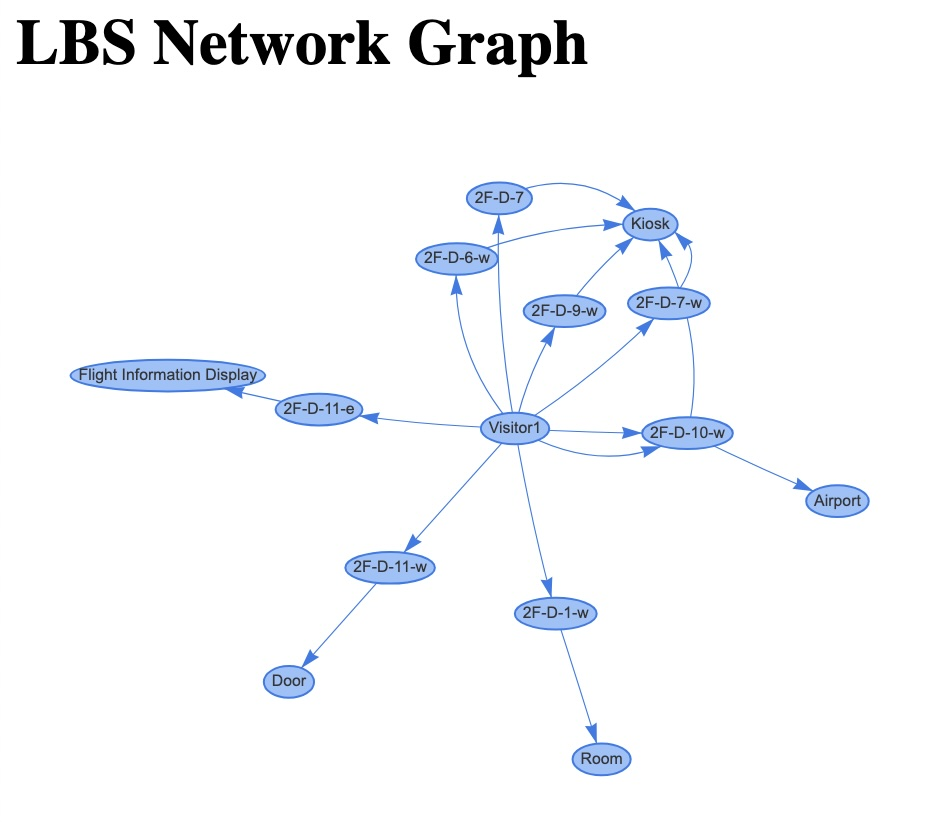

# Airport: A Smart Airport Simulation

[](https://godotengine.org)
[](https://ai.google.dev/)

(Work in progress)

This project is a work-in-progress simulation of a "smart airport" environment, showcasing the power of AI, particularly Google's Gemini model, to create interactive and intelligent experiences. The simulation is built using the Godot Engine.

<table>
  <tr>
    <td>
      
    </td>
    <td>
      
    </td>
  </tr>
    <tr>
    <td>
      
    </td>
    <td>
      
    </td>
  </tr>
</table>

## Table of Contents

- [Inspiration](#inspiration)
- [Features](#features)
- [Core Components](#core-components)
- [Project Structure](#project-structure)
- [Getting Started](#getting-started)
  - [Prerequisites](#prerequisites)
  - [API Key Management](#api-key-management)
- [AI Agent Implementation](#ai-agent-implementation)
  - [Chat History and Multimodal Input](#chat-history-and-multimodal-input)
  - [Function Calling](#function-calling)
- [Model Context Protocol (MCP)](#model-context-protocol-mcp)
- [Network Graph](#network-graph)
  - [Generation](#generation)
  - [Visualization](#visualization)
- [Context Engineering](#context-engineering)
- [Development Notes](#development-notes)
- [Contributing](#contributing)
- [Future Work](#future-work)
- [License](#license)

## Inspiration

The inspiration for this project comes from a past experiment with an AI Drive Recorder App on an Android smartphone. Carrying it in a chest pocket, it felt like a wearable AI, hinting at the potential for such technology. I also once developed an AR app for Android, but my stakeholders did not show interest in it. With the advent of smart glasses and advanced AI agents, the value of this concept has grown exponentially. This project explores that potential in the context of a smart airport.

<table>
  <tr>
    <td>
      
    </td>
    <td>
      
    </td>
  </tr>
</table>

## Motivation

I believe the current boom in AI agents in the IT world will not last long, and its focus will be shifting to the OT (Operational Technology) world, where there is a serious labor shortage and a strong demand for increased efficiency. Originally, DX (Digital Transformation) was supposed to be focused on OT (Operational Technology) in the first place.

## Features

*   **AI-Powered Chat:** Interact with the airport environment using natural language through a chat interface powered by the Gemini AI model.
*   **Multimodal Input:** The AI can "see" and understand the environment through image captures from the player's viewpoint.
*   **Function Calling:** The AI can interact with the simulation by calling functions to perform actions like opening doors.
*   **Dynamic Location Learning:** The AI learns the locations of amenities in the airport through visual-based interaction and data logging.
*   **Network Graph Generation:** Generate a network graph to visualize the relationships between visitors, zones, and amenities.
*   **Web-Based Visualization:** View the generated network graph in an interactive web-based viewer built with SvelteKit.

## Core Components

*   **Godot Simulation (`airport/`):** The main airport simulation built with the Godot Engine.
    *   **`Airport.tscn`:** The main scene of the simulation.
    *   **`McpClient` & `McpServer`:** Manages the AI interaction, including communication with the Gemini AI, and in-environment actions. It also simulates a wearable device with a camera, microphone, and speaker.
    *   **`locations.json`:** Stores the data collected by the AI agent about the locations of amenities.
*   **Network Graph Viewer (`viewer/`):** A SvelteKit application to visualize the network graph data.
*   **Blender Models (`blender/`):** The source `.blend` files for the 3D models used in the simulation.
*   **Documentation (`docs/`):** Contains project documentation, including the MCP specification and context engineering notes.

## Project Structure

```
.
├── airport/              # Godot project
├── blender/              # Blender source files
├── data/                 # Generated data (e.g., network graph)
├── docs/                 # Project documentation
├── images/               # Gemini generated images
├── viewer/               # SvelteKit network graph viewer
└── README.md
```

## Getting Started

### Prerequisites

*   Godot Engine (version 4.4 or later)
*   A Gemini API key
*   Node.js and npm (for the viewer)

### API Key Management

To use the AI features, you need to provide a Gemini API key. Create a file named `gemini_api_key_env.txt` in the `airport` directory and place your Gemini API key in it.

**`gemini_api_key_env.txt`:**
```
YOUR_GEMINI_API_KEY
```

This file is listed in `.gitignore` and will not be committed to version control. The application will automatically read the key from this file.

## AI Agent Implementation

The AI agent, powered by the Gemini model, interacts with the airport environment using natural language and visual input.

### Chat History and Multimodal Input

The agent maintains a conversation history, allowing for contextual understanding. User input can be multimodal, combining text with inline image data (Base64 encoded JPEGs) captured from the player's viewpoint. This enables the AI to "see" and understand the environment. It's important to note that while the image is sent to the AI for analysis, the Base64 encoded image data is not stored in the chat history to avoid excessive memory usage.

### Function Calling

The AI uses Gemini's function calling feature to interact with the simulation. The `McpServer` and `McpClient` nodes define a set of tools (functions) that the AI can call to perform actions (e.g., opening doors) or retrieve information. When the AI decides to use a tool, it generates a `functionCall` in its response, which is then executed by the system.

Since the Gemini API does not fully support the Model Context Protocol (MCP) at this time, this implementation relies on Gemini's function calling capability as a temporary measure. We anticipate that full MCP support will be available in the near future.

### AI Agents and Location-Based Services

AI Agents at airports offer various services that are often linked to a passenger's location. While traditional indoor positioning has relied on methods like beacons and Wi-Fi, the era of generative AI enables a new approach: determining a user's indoor location and providing location-based services (LBS) entirely through image data.

This process works as follows: the AI Agent, operating on a passenger's wearable device, uses the camera to learn the positions of different amenities throughout the terminal. The **AI Agent** then accurately pinpoints its location by recognizing and processing **Zone IDs** posted within the airport environment. This innovative method eliminates the need for conventional indoor positioning infrastructure, leveraging the visual information available to the user's device.


### How the Simulator Learns Amenity Locations

The simulation employs a unique process for dynamically learning and recording the locations of various amenities within the airport. This is achieved through the visitor's wearable device and the power of generative AI, without relying on pre-existing maps or location data.

Here's a step-by-step breakdown of how it works:

1.  **Visual-Based Interaction**: The process begins when a visitor, equipped with a wearable device (simulated as the first-person view), looks at an amenity (e.g., a vending machine, a check-in counter).

2.  **Image Capture**: When the visitor interacts with the AI assistant (e.g., by asking a question), the wearable device captures an image of their current view.

3.  **AI Analysis**: This image is sent to the Gemini AI model for analysis. The AI is prompted to identify two key pieces of information from the image:
    *   The **Zone ID**: A unique identifier for the specific area or zone the visitor is in. These Zone IDs are visually present in the environment.
    *   The **Amenity**: The specific object or service the visitor is looking at.

4.  **Data Logging**: Once the AI successfully identifies both the Zone ID and the amenity, it calls a specific function (`record_user_data`). This function logs the collected data—the visitor's ID, the Zone ID, and the name of the amenity—into a structured data file (`locations.json`).

5.  **Building a Knowledge Base**: Over time, as the visitor explores the airport and interacts with various amenities, this process builds a comprehensive knowledge base of what amenities are located in which zones. This data can then be used for various purposes, such as generating a network graph of the airport's layout or providing location-based recommendations to other visitors.

This innovative approach allows the airport environment to be "self-mapping," where the locations of services are learned organically through user interaction and AI-powered environmental understanding.

#### Sample Data

Here is an example of what the `locations.json` file looks like after a visitor has explored the airport and interacted with a few amenities:

```json
{"amenities":"Kiosk","time":"2025-08-16T23:42:44","visitor_id":"Visitor1","zone_id":"2F-D-10-w"},
{"amenities":"self-service kiosk","time":"2025-08-16T23:42:57","visitor_id":"Visitor1","zone_id":"2F-D-10-w"},
{"amenities":"Zone 2F-D-10-w","time":"2025-08-16T23:43:16","visitor_id":"Visitor1","zone_id":"2F-D-10-w"},
{"amenities":"a kiosk and airport zone signs","time":"2025-08-17T00:08:44","visitor_id":"Visitor1","zone_id":"2F-D-10-w"},
{"amenities":"snack shop","time":"2025-08-17T00:22:27","visitor_id":"Visitor1","zone_id":"2F-D-9-w"},
{"amenities":"self-checkout kiosk and refrigerators","time":"2025-08-17T00:23:58","visitor_id":"Visitor1","zone_id":"2F-E-1"},
```

## Model Context Protocol (MCP)

The underlying specification for the AI's interaction with the airport environment is based on the Model Context Protocol (MCP). This specification, generated by Gemini, outlines a framework for a smart airport's AI initiatives. For more details, please see the [MCP Specification](./docs/MCP_SPEC.md).

**Note:** The current implementation mimics MCP, as the Gemini API only partially supports the MCP specification. This implementation uses direct API calls rather than STDIO or HTTP to access MCP services.

## Network Graph

### Generation

A network graph generation feature has been added to visualize the relationships between amenities in the airport. It makes use of Gemini for network graph generation from a log file. This feature outputs the generated graph in the `data` folder.

To initiate the management function, you can use the chat UI and ask something like "initiate management function".

### Visualization

The generated network graph data can be visualized using a SvelteKit application in the `viewer` directory. This provides a visual representation of the connections between visitors, zones, and amenities.



#### Running the Viewer

To run the SvelteKit application:

1.  Navigate to the `viewer` directory:
    ```bash
    cd viewer
    ```

2.  Install the dependencies:
    ```bash
    npm install
    ```

3.  Start the development server:
    ```bash
    npm run dev
    ```

This will start the SvelteKit development server, and you can view the network graph in your browser at the address provided.

## Context Engineering

This project is a practical example of context engineering, demonstrating how to build a complex AI agent that interacts with its environment. For more information on the concept of context engineering, please see the [CONTEXT_ENGINEERING.md](docs/CONTEXT_ENGINEERING.md) file.

## Development Notes

I am using https://github.com/Coding-Solo/godot-mcp with Gemini CLI for code review.

## Future Work

*   Expand the set of tools and resources available to the AI agent.
*   Implement more complex scenarios and interactions in the simulation.
*   Enhance the network graph visualization with more features and data.
*   Integrate with other AI services and APIs.

## License

This project is licensed under the terms of the MIT license.
