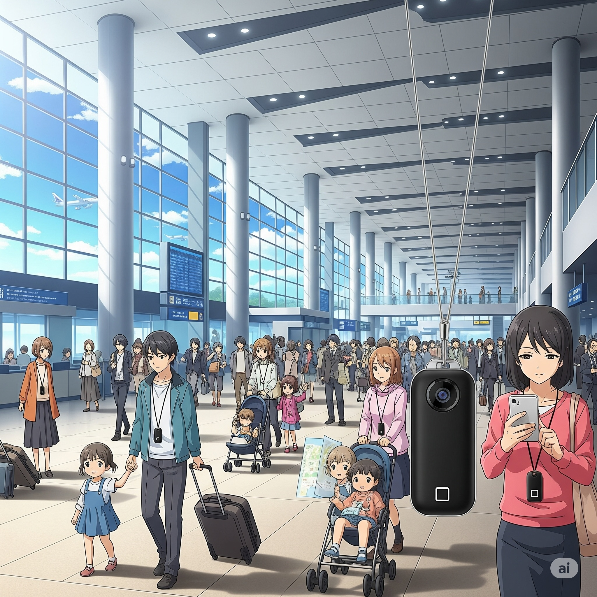
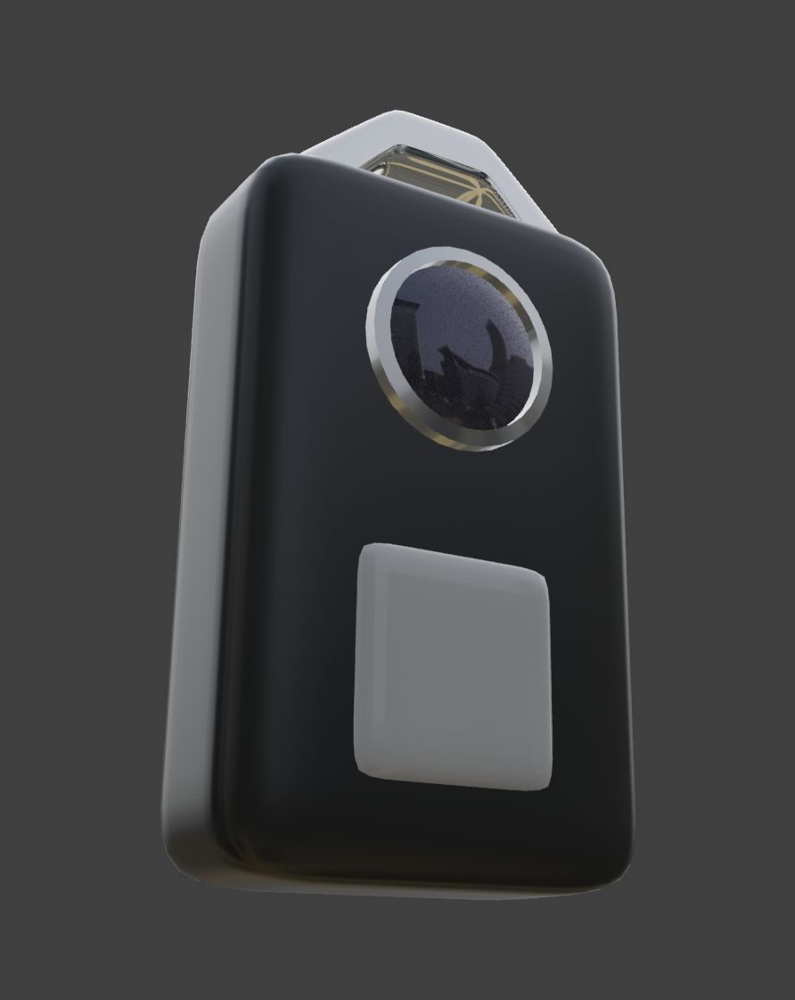
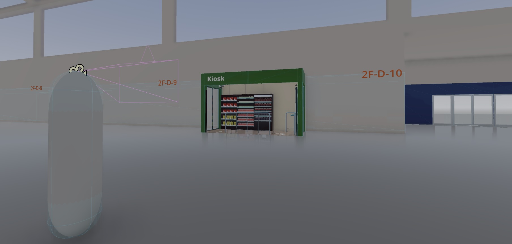

# Airport: A Smart Airport Simulation

This project is a work-in-progress simulation of a "smart airport" environment, showcasing the power of AI, particularly Google's Gemini model, to create interactive and intelligent experiences. The simulation is built using the Godot Engine.

<table>
  <tr>
    <td>
      
    </td>
    <td>
      
    </td>
  </tr>
</table>

## Table of Contents

- [Inspiration](#inspiration)
- [Core Components](#core-components)
- [Getting Started](#getting-started)
  - [Prerequisites](#prerequisites)
  - [API Key Management](#api-key-management)
- [AI Agent Implementation](#ai-agent-implementation)
  - [Chat History and Multimodal Input](#chat-history-and-multimodal-input)
  - [Function Calling](#function-calling)
- [Model Context Protocol (MCP)](#model-context-protocol-mcp)
- [License](#license)

## Inspiration

The inspiration for this project comes from a past experiment with an AI Drive Recorder App on an Android smartphone. Carrying it in a chest pocket, it felt like a wearable AI, hinting at the potential for such technology. I also once developed an AR app for Android, but my stakeholders did not show interest in it. With the advent of smart glasses and advanced AI agents, the value of this concept has grown exponentially. This project explores that potential in the context of a smart airport.

<table>
  <tr>
    <td>
      
    </td>
    <td>
      
    </td>
  </tr>
</table>

## Core Components

-   **Main Scene (`airport/Airport.tscn`):** The central scene that orchestrates the entire airport simulation.
-   **McpClient (`airport/mcp_client.gd`):** The heart of the AI interaction, managing the UI, communication with the Gemini AI, and in-environment actions.
-   **Airport Services (`airport/airport_services.gd`):** A centralized script for managing airport services like door control.
-   **Wearable Device (Smartkey):** A conceptual smartkey device with a camera, microphone, and speaker, serving as the primary interface with the AI agent.

## Getting Started

### Prerequisites

-   Godot Engine (version 4.x)
-   A Gemini API key

### API Key Management

To use the AI features, you need to provide a Gemini API key:

1.  Open the `Airport.tscn` scene in the Godot editor.
2.  Select the `McpClient` node in the Scene tree.
3.  In the Inspector tab, find the "Gemini Api Key" field and paste your key.

This method avoids hardcoding your API key in scripts and keeps it out of version control.

## AI Agent Implementation

The AI agent, powered by the Gemini model, interacts with the airport environment using natural language and visual input.

### Chat History and Multimodal Input

The agent maintains a conversation history, allowing for contextual understanding. User input can be multimodal, combining text with inline image data (Base64 encoded JPEGs) captured from the player's viewpoint. This enables the AI to "see" and understand the environment.

### Function Calling

The AI uses Gemini's function calling feature to interact with the simulation. The `McpServer` and `McpClient` nodes define a set of tools (functions) that the AI can call to perform actions (e.g., opening doors) or retrieve information. When the AI decides to use a tool, it generates a `functionCall` in its response, which is then executed by the system.

### AI Agents and Location-Based Services

AI Agents at airports offer various services that are often linked to a passenger's location. While traditional indoor positioning has relied on methods like beacons and Wi-Fi, the era of generative AI enables a new approach: determining a user's indoor location and providing location-based services (LBS) entirely through image data.

This process works as follows: the AI Agent, operating on a passenger's wearable device, uses the camera to learn the positions of different amenities throughout the terminal. The **AI Agent** then accurately pinpoints its location by recognizing and processing **Zone IDs** posted within the airport environment. This innovative method eliminates the need for conventional indoor positioning infrastructure, leveraging the visual information available to the user's device.

## Model Context Protocol (MCP)

The underlying specification for the AI's interaction with the airport environment is based on the Model Context Protocol (MCP). This specification, generated by Gemini, outlines a framework for a smart airport's AI initiatives. For more details, please see the [MCP Specification](./docs/MCP_SPEC.md).

**Note:** The current implementation mimics MCP, as the Gemini API only partially supports the MCP specification. This implementation uses direct API calls rather than STDIO or HTTP to access MCP services.

## License

This project is licensed under the terms of the MIT license.
