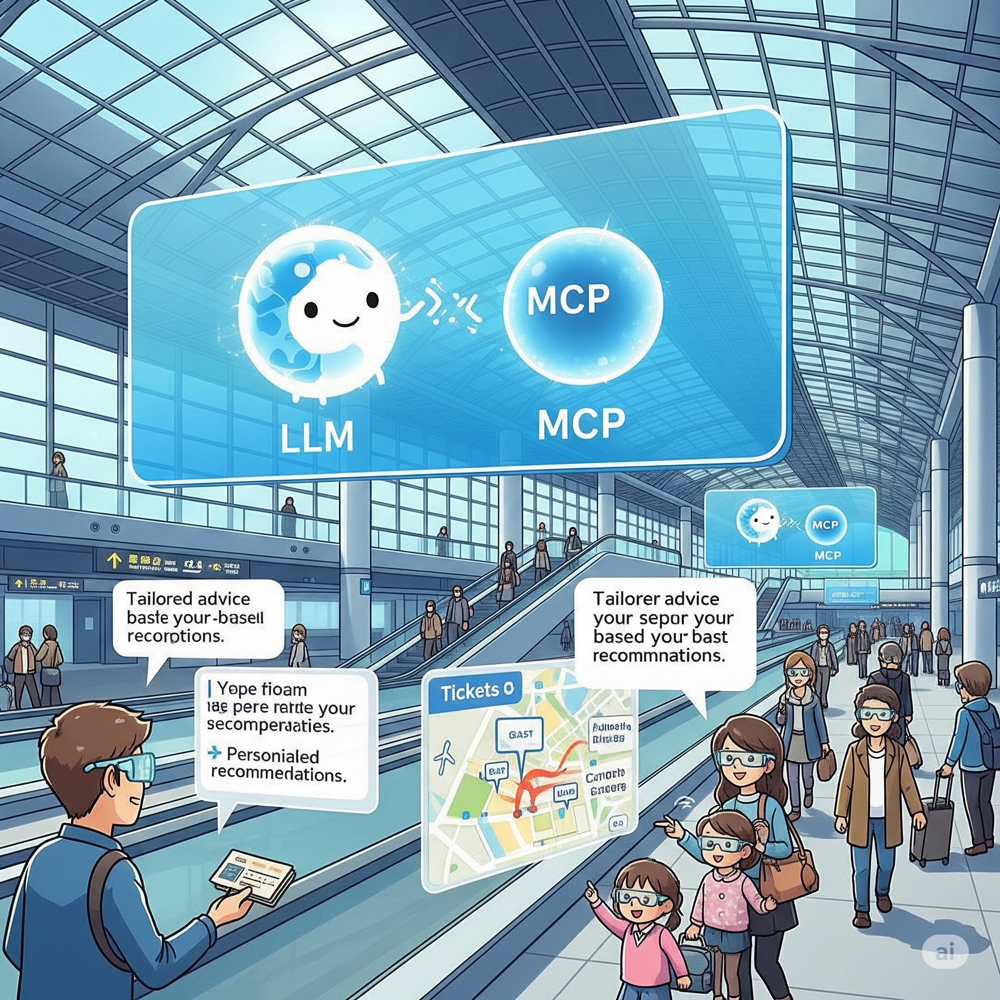

# Airport

**Note:** The `gemini_api_key_env.txt` file, which contains the `GEMINI_API_KEY`, should be placed in the `airport` directory. This file is ignored by the root `.gitignore` file, so it will not be committed to the repository.

## Gemini's Role in This Project

This project heavily leverages the Gemini AI model throughout its development and functionality. Gemini has been instrumental in various aspects, including:

-   **Specification Generation:** The Model Context Protocol (MCP) specification detailed below was generated by Gemini, providing a comprehensive framework for the airport's smart initiatives.
-   **Code Generation:** Portions of the project's codebase, particularly utility functions and AI interaction logic, have been assisted or directly generated by Gemini.
-   **Multimodal Interaction:** Gemini powers the AI agent's ability to understand and respond to both text and visual input (via screen capture), enabling a more intuitive user experience.
-   **Documentation Enhancement:** This README itself, including descriptions and explanations, has been refined and improved with Gemini's assistance to ensure clarity and better English.

(Work in progress)

<table>
  <tr>
    <td>
      
    </td>
    <td>
      
    </td>
  </tr>
</table>

## What I really developed at work five years ago

I developed an AI Drive Recorder App for Android smartphones. One day, I was told that if I put it in my chest pocket, it could be applied to other uses, so I actually experimented with it. It felt like an AI drive recorder that a person wears. I strongly felt the potential of this app. 

Currently, with the evolution of smart glasses and AI agent technology, it seems the value of this type of app will dramatically increase.


## Implementation

This project is a work-in-progress implementation of the following specification.

**Note:** This prototype uses direct API calls with function calling to mimic MCP, instead of relying on STDIO or a REST API.

## Core Components

### Main Scene

The main scene of the project is now `airport/Airport.tscn`. This scene orchestrates the various components of the airport simulation.

### McpClient Node

The `McpClient` node (`airport/mcp_client.gd`) serves as the central hub for user interaction and AI communication within the project. It orchestrates the flow of information between the user interface (chat window), the AI model, and the airport's services (via `McpServer`).

Key responsibilities include:

-   **User Input Handling:** Manages the chat window, capturing user queries and displaying AI responses.
-   **AI Integration:** Initializes and communicates with the Gemini AI model, sending user queries and receiving AI-generated text and function calls.
-   **Multimodal Input:** Captures real-time screenshots from the player's perspective and sends them to the AI, enabling the AI to understand visual context.
-   **Service Orchestration:** Interacts with the `McpServer` to execute AI-determined actions, such as controlling doors or retrieving information about the player's location.

**Configurable Parameters:**

The `McpClient` node exposes the following parameters, which can be configured within the Godot editor:

-   `first_person` (NodePath to `CharacterBody3D`): This parameter should be set to the `CharacterBody3D` node representing the player character. It is essential for the AI to understand the player's position and to capture images from their viewpoint.
-   `camera_resolution_height` (Integer): Defines the desired height (in pixels) for the images captured and sent to the AI. The width is automatically scaled to maintain the aspect ratio. A lower resolution can improve performance.
-   `llm_model` (String, Enum): Specifies the Gemini model to be used for AI interactions. Options include "gemini-2.0-flash" and "gemini-2.5-flash".

### Wearable Device: The Smartkey

To interact with the AI agent, this project envisions a 'smartkey' as a dedicated wearable device. This universal key, equipped with an embedded camera, microphone, and speaker, can be used to operate anything from a car to a house door. It also serves as a biometric authenticator for services at the airport and beyond. It serves as a seamless, hands-free interface for the user, evolving the initial concept of a chest-worn smartphone into a more specialized and integrated piece of hardware.


## AI Agent Implementation Details

This project features an AI agent powered by Google's Gemini model, designed to interact with the airport environment through natural language and visual input. The implementation leverages Gemini's function calling capabilities to enable the AI to perform actions and retrieve information from the simulated airport.

### Chat History and Multimodal Input

The AI agent maintains a conversation history to understand context and provide relevant responses. This history is structured as an array of "content" objects, each representing a turn in the conversation.

```json
[
  {
    "role": "user",
    "parts": [
      {
        "text": "What is the status of the main entrance door?"
      }
    ]
  },
  {
    "role": "model",
    "parts": [
      {
        "text": "The main entrance door is currently closed."
      }
    ]
  },
  {
    "role": "user",
    "parts": [
      {
        "text": "Can you open it?",
        "inline_data": {
          "mime_type": "image/jpeg",
          "data": "BASE64_ENCODED_IMAGE_DATA"
        }
      }
    ]
  }
]
```

As shown above, user messages can include both text and inline image data (Base64 encoded JPEG). This multimodal input allows the AI to understand visual cues from the player's perspective, such as identifying objects or assessing the environment. The `McpClient` node captures screenshots from the player's camera and encodes them for inclusion in the chat history.

### Function Calling

The AI agent's ability to interact with the airport environment is facilitated by Gemini's function calling feature. The `McpServer` node defines a set of available tools (functions) that the AI can "call" to perform specific actions or retrieve dynamic information.

Here's an example of a tool definition for controlling a door:

```gdscript
const DOOR_CONTROL_TOOL = {
    "name": "door_control",
    "description": """
    A function to open or close the door.
    If the area name is unknown, this function is not called.
    """,
    "parameters": {
        "type": "object",
        "properties": {
            "area": {
                "type": "string",
                "description": "Area name where the door is located."
            },
            "control": {
                "type": "string",
                "enum": ["open", "close"]
            }
        },
        "required": ["control"]
    }
}
```

When the AI determines that a user's request can be fulfilled by one of these tools, it generates a `functionCall` in its response. The `gemini.gd` script intercepts this `functionCall`, executes the corresponding function on the `McpServer`, and then appends the function's response back into the chat history. This allows the AI to reason about the outcome of its actions and continue the conversation.

For instance, if the AI decides to open a door, the `gemini.gd` script will execute `mcp_server.door_control({"area": "Entrance_2F_2", "control": "open"})`. The result of this operation is then fed back to the AI, enabling a continuous and interactive dialogue.

```json
{
  "role": "model",
  "parts": [
    {
      "functionCall": {
        "name": "door_control",
        "args": {
          "area": "Entrance_2F_2",
          "control": "open"
        }
      }
    }
  ]
}
```

The `mcp_server.gd` script contains the actual implementations of these functions, delegating tasks to other nodes or utility scripts as needed. This modular design ensures a clear separation of concerns and allows for easy expansion of the AI's capabilities.

### At the moment

https://github.com/user-attachments/assets/45cc041f-88ca-47e5-bb7c-76915c546d6d

## This MCP spec is generated by Gemini.

ABC International Airport (ABC) is a prime candidate for implementing the Model Context Protocol (MCP) to enhance its "smart airport" initiatives, which already include advanced technologies like biometrics, self-service kiosks, and AI-powered operations. MCP can act as the unifying layer for these diverse systems, allowing AI to leverage them more effectively for improved passenger experience, operational efficiency, and security.

(Note: ABC is a fictional name.)

Here's how MCP could be applied at ABC International Airport:

### 1. Enhanced Passenger Experience with AI-Native Assistance:

Tools:
- flight_status_check(flight_number: str, date: str): An AI assistant can use this tool to provide real-time updates on flight delays, gate changes, or boarding times.
- Maps_to_gate(gate_number: str): Integrates with ABC's indoor navigation systems to guide passengers using an AI chatbot or digital signage.
- find_amenity(type: str, terminal: str): Helps passengers locate restrooms, restaurants, lounges, or duty-free shops, potentially even booking reservations (e.g., book_restaurant_table(restaurant_id: str, time: str, guests: int)).
- translate_phrase(text: str, target_language: str): Provides on-the-spot translation for non-Japanese speaking passengers interacting with airport staff or signage.
- report_lost_item(description: str, location: str): Allows passengers to quickly report lost luggage or personal items via an AI interface.

Resources:
- airport_map://{terminal_id}: Provides dynamic, up-to-date maps with real-time congestion data, amenity locations, and security wait times.
- boarding_pass://{passenger_id}: Securely provides AI agents with passenger's boarding pass details (flight number, seat, boarding time) for personalized assistance.
- food_options://{terminal_id}/{cuisine_type}: Dynamic list of dining options filtered by terminal, cuisine, or dietary restrictions, including current opening hours and estimated wait times.
- train_schedule://ABC_express_to_tokyo: Real-time train schedules and platform information for airport access.

### 2. Optimized Airport Operations and Management:

Tools:
- assign_gate(flight_id: str, new_gate: str): Allows an AI-powered operations system to dynamically re-assign gates based on real-time factors like delays, maintenance, or passenger flow, potentially minimizing taxi times.
- dispatch_baggage_handler(flight_id: str, priority: str): Automatically dispatches personnel for baggage handling based on flight arrival, departure, and priority.
- alert_security(incident_type: str, location: str): AI systems monitoring surveillance feeds or sensor data can use this tool to alert security personnel to anomalies or incidents.
- adjust_lighting(zone_id: str, intensity: int): For energy management, AI can dynamically adjust lighting in different terminal zones based on passenger density or natural light.
- update_display_boards(display_id: str, content: json): Allows AI to update flight information display systems instantly.

Resources:
- realtime_traffic://{zone_id}: Live data on passenger traffic within terminals, security checkpoints, and immigration lines, enabling AI to predict bottlenecks and suggest re-routing.
- baggage_flow://{belt_id}/status: Real-time status of baggage conveyor belts, detecting potential jams or slowdowns.
- aircraft_positions://live: Live aircraft positioning data on ABC's runways and taxiways for air traffic control assistance.
- weather_forecast://ABC_airport/next_24h: Real-time and predictive weather data impacting flight operations.
- staff_availability://{department_id}: Anonymous data on available staff in different airport departments for efficient resource allocation.

### 3. Enhanced Security and Safety:

Tools:
- lock_door(door_id: str): In an emergency, an AI system can trigger lockdown protocols for specific areas.
- activate_alarm(alarm_zone: str): Trigger alarms in response to detected threats.
- deploy_emergency_response(team_type: str, location: str): AI can assist in coordinating emergency response teams.

Resources:
- security_feed://{camera_id}/live: Real-time, anonymized video streams from security cameras (with privacy safeguards) for AI-driven anomaly detection.
- access_logs://{area_id}/last_hour: Logs of access control systems to monitor unauthorized entries.
- sensor_data://{sensor_type}/realtime: Readings from smoke detectors, chemical sensors, or structural health monitors.

### 4. Predictive Maintenance and Infrastructure Management:

Tools:
- schedule_maintenance(equipment_id: str, type: str, date: str): AI can predict equipment failures (e.g., HVAC, baggage systems, escalators) and use this tool to schedule preventative maintenance.
- order_spare_part(part_id: str, quantity: int): If an AI predicts a component failure, it can automatically trigger an order for a replacement.

Resources:
- equipment_status://{equipment_id}: Real-time operational data from all airport machinery, including performance metrics, error codes, and historical usage.
- maintenance_log://{equipment_id}: History of past maintenance, repairs, and part replacements.
- utility_consumption://{zone_id}/hourly: Data on electricity, water, and gas consumption for energy optimization and anomaly detection.

## Why MCP is particularly beneficial for ABC:

### Existing Smart Airport Initiatives

ABC already invests heavily in smart technologies (biometrics, self-service, AI for operations). MCP provides a cohesive framework to integrate these disparate systems and leverage their data more effectively with advanced AI.
High Passenger Volume: As a major international hub, ABC experiences high passenger traffic. MCP-powered AI can help manage this flow, reduce bottlenecks, and personalize experiences at scale.

### Disruption Management

Airports are highly susceptible to disruptions (weather, technical issues, security threats). MCP allows AI to rapidly access real-time data and trigger appropriate tools for efficient disruption recovery.
Complex Ecosystem: Airports involve numerous stakeholders (airlines, ground handlers, customs, immigration, retail, security). MCP can provide a common language for these entities to share and act upon contextual information with AI.
By implementing MCP, ABC International Airport could move towards a truly intelligent, adaptive, and highly efficient operational model, further enhancing its reputation as a leading smart airport.
